# 阅读路线 
> 阅读 小清新

## 更新
> 2015/12/24  Version 1.0 Beta 

## 简介
> 在生活中，人们对于购买的书籍，往往在刚购买几日时会有极高的兴趣阅读，后来因为种种原因，就丢弃在一边，以至于最后自己都忘了买过这本书。针对这种情况，我们决定开发一款移动端应用，来帮助人们管理购买的书籍，做到物尽其用，让书籍不再只是摆设。用户使用它，可以进行读书计划安排, 定时提醒、阅读本地TXT电子书、添加读书笔记、获取好书资讯。

## 分类
> 效率办公
笔记
阅读

## 截图

### 首页
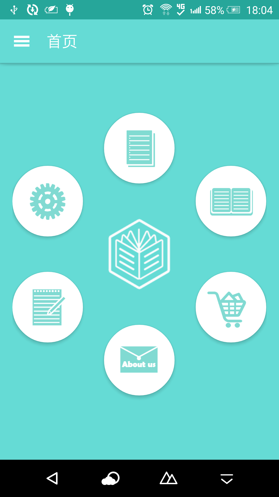

### 添加计划
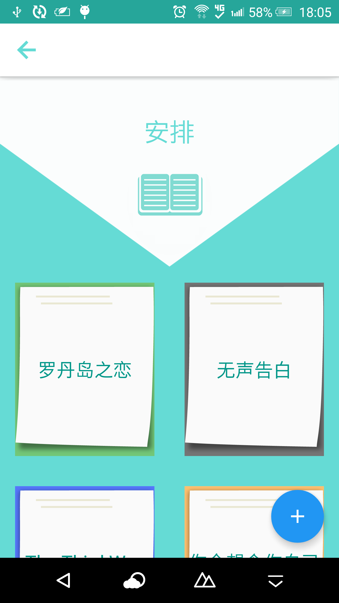
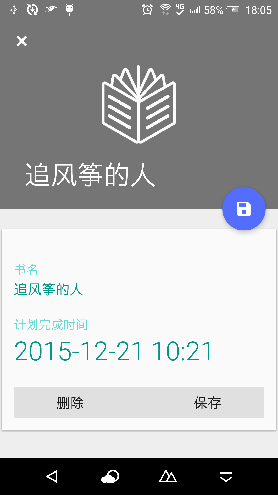

### 添加笔记
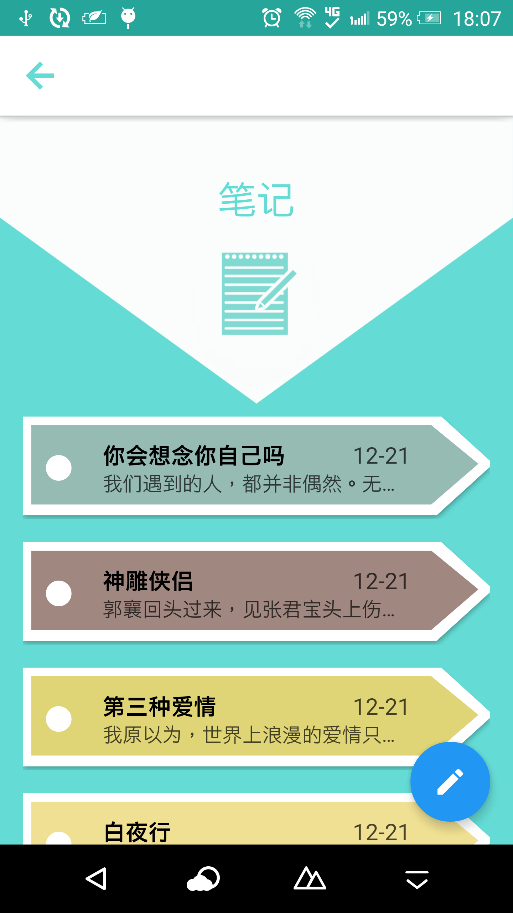
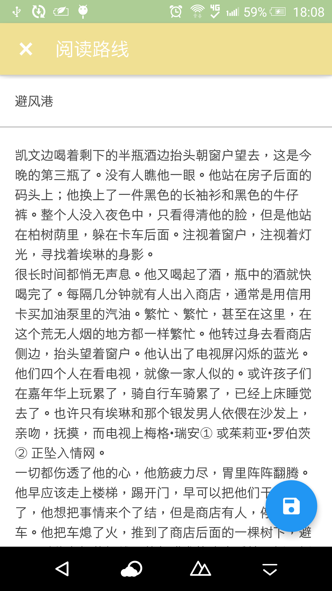

### 阅读本地TXT文件
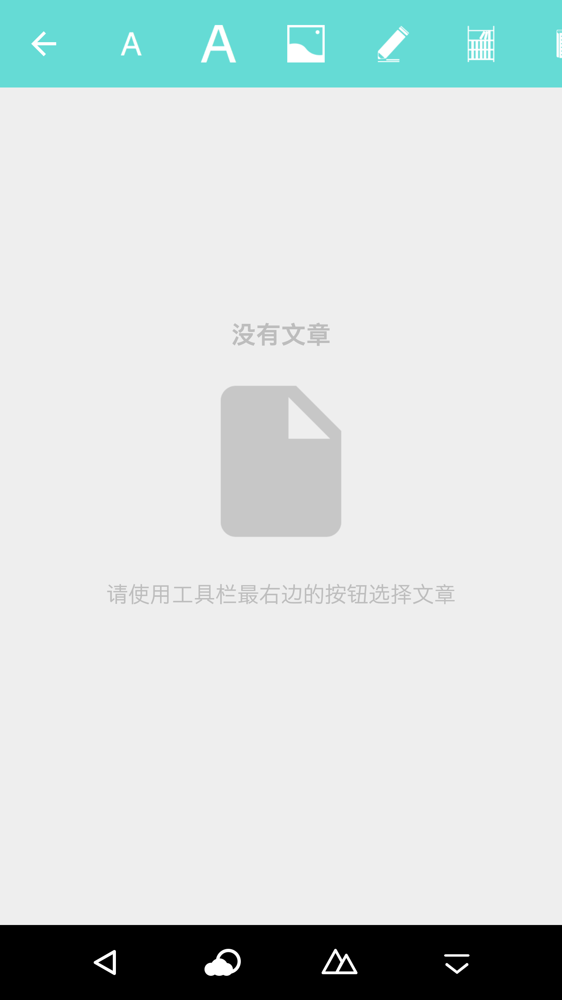
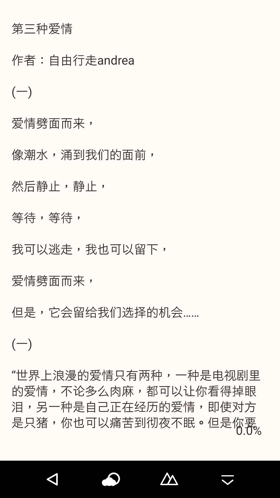

### 豆瓣读书推荐
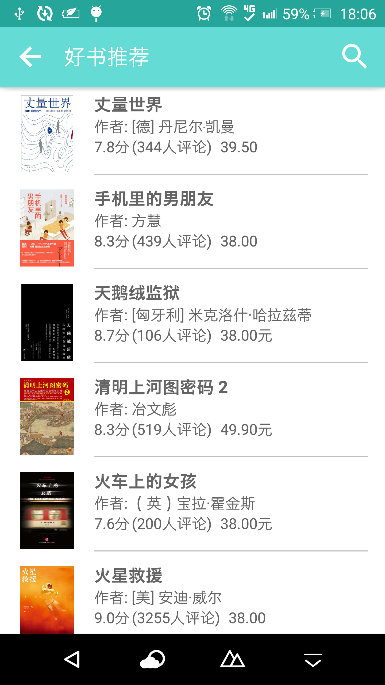
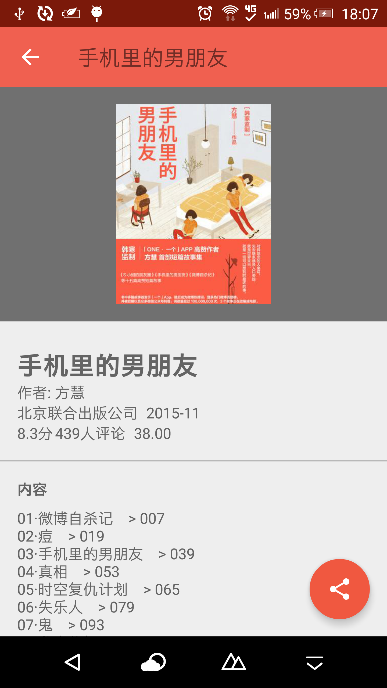

### 设置
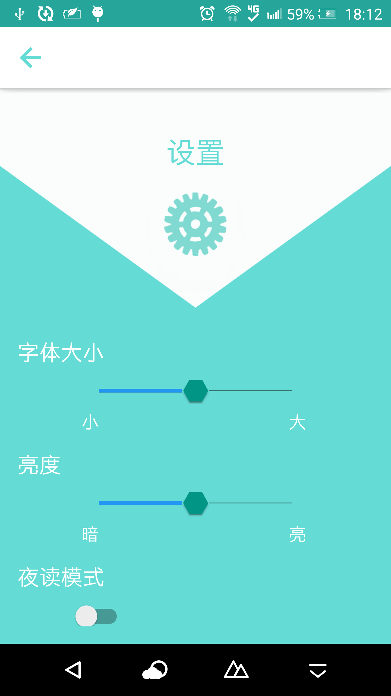

### 关于
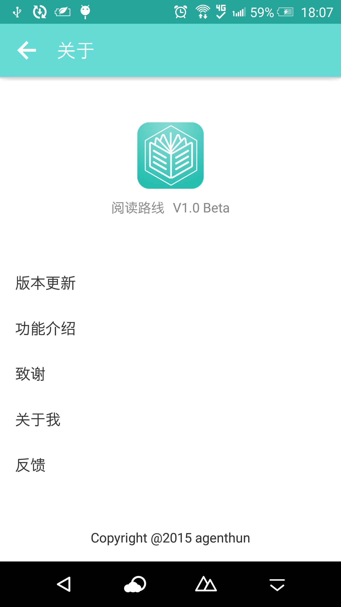

### 登陆用户
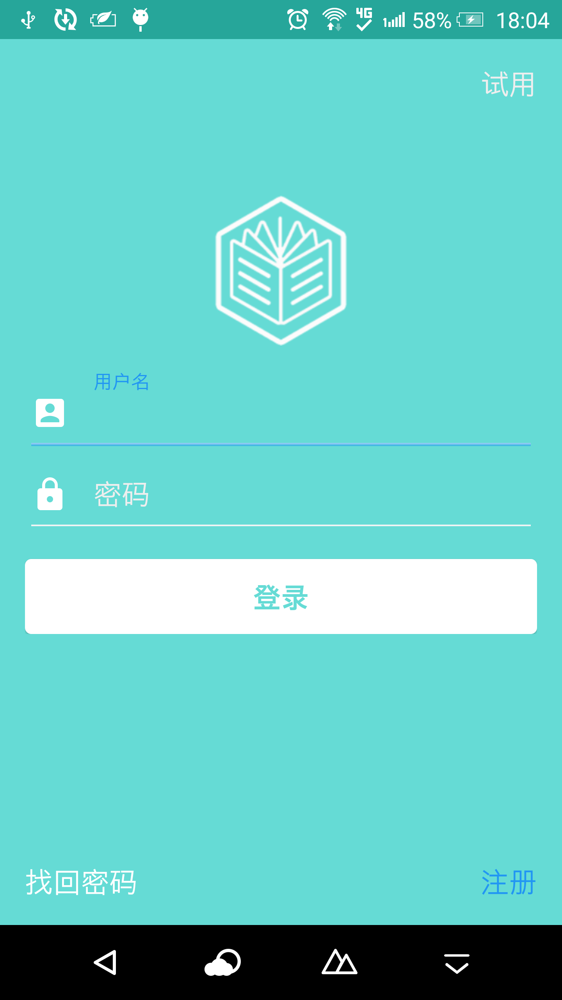
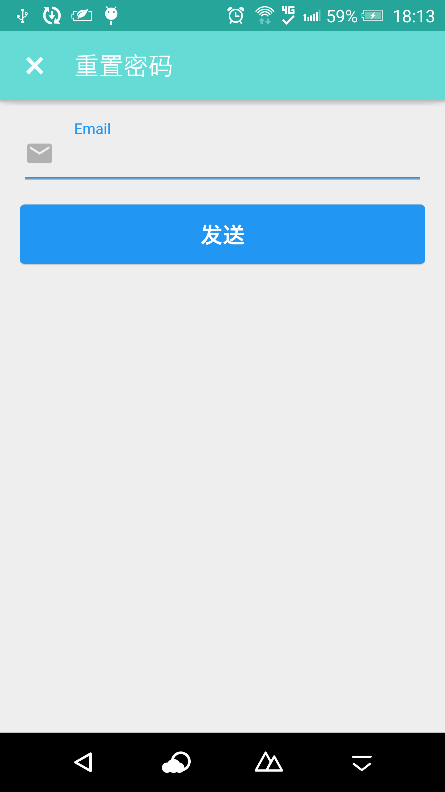
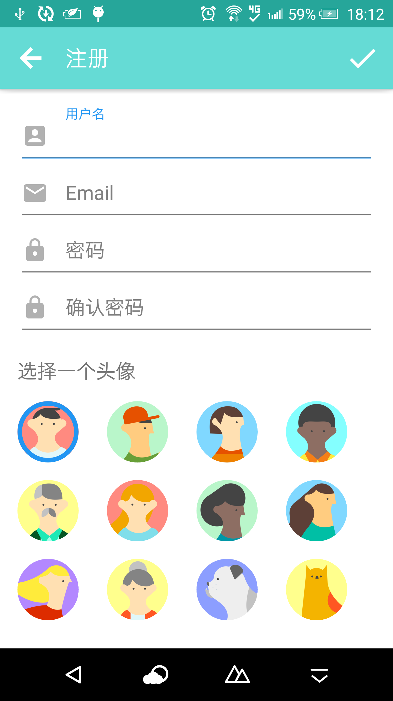
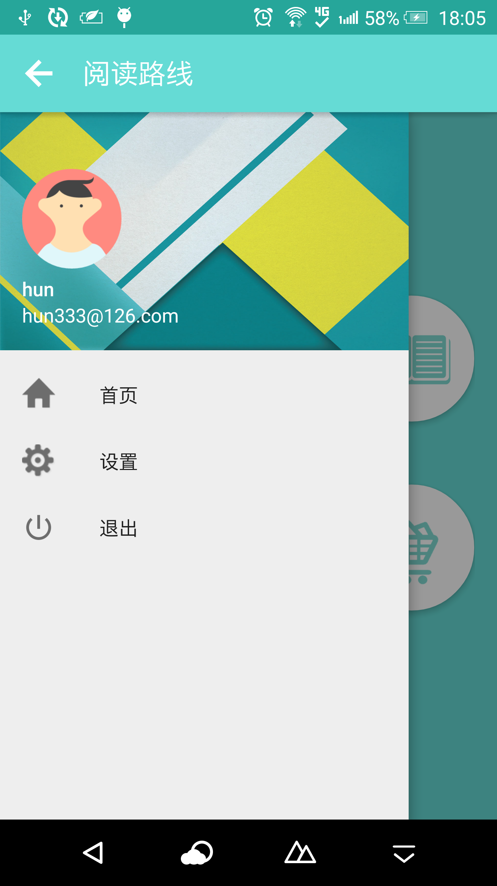

## 下载APP

> [豌豆荚](http://www.wandoujia.com/apps/com.agenthun.readingroutine)

> [应用宝](http://android.myapp.com/myapp/detail.htm?apkName=com.agenthun.readingroutine)

